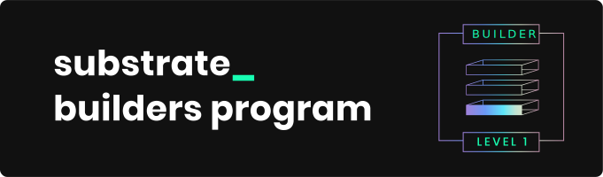

# Societal Node 

## Getting Started

Follow the steps below to get started with the Societal's node.

### Using Nix

Install [nix](https://nixos.org/) and optionally [direnv](https://github.com/direnv/direnv) and
[lorri](https://github.com/nix-community/lorri) for a fully plug and play experience for setting up
the development environment. To get all the correct dependencies activate direnv `direnv allow` and
lorri `lorri shell`.

### Rust Setup

First, complete the [basic Rust setup instructions](./docs/rust-setup.md).

### Run

Use Rust's native `cargo` command to build and launch the node:

```sh
cargo run --release -- --dev
```

### Build

The `cargo run` command will perform an initial build. Use the following command to build the node
without launching it:

```sh
cargo build --release
```

### Embedded Docs

Once the project has been built, the following command can be used to explore all parameters and
subcommands:

```sh
./target/release/societal-node -h
```

## Run

### Development Parachain

Learn more about parachains [here](https://wiki.polkadot.network/docs/learn-parachains), and parathreads [here](https://wiki.polkadot.network/docs/learn-parathreads).

#### Run Rococo Local Testnet

Refer to the [Prepare a local relay chain](https://docs.substrate.io/tutorials/build-a-parachain/prepare-a-local-relay-chain/) section of the `Build a parachain` tutorial

#### Run Societal Parachain Node

Refer to [Connect a local parachain](https://docs.substrate.io/tutorials/build-a-parachain/connect-a-local-parachain/) section of the `Build a parachain` tutorial

### Connect with Polkadot-JS Apps Front-end

Once the node template is running locally, you can connect it with **Polkadot-JS Apps** front-end
to interact with your chain. [Click
here](https://polkadot.js.org/apps/#/explorer?rpc=ws://localhost:8844) connecting the Apps to your
local node template.

### Connect with Societal Front-end

Alternativley you can use the **Societal's front-end** to connect with the local node. Please find the societal front-end repo [here](https://github.com/sctllabs/societal-front-end). Follow the readme for instructions on how to build and run the front-end. 

### Societal's Runtime

Review Societal's [runtime implementation](./runtime/src/lib.rs) included in this node. This file configures several pallets that make up Societal's runtime. Each pallet has its own code block that begins with `impl $PALLET_NAME::Config for Runtime`, which define its configuration settings. Then the pallets are composed into a single runtime by way of the `construct_runtime!` macro. 

### Run in Docker

First, install [Docker](https://docs.docker.com/get-docker/) and
[Docker Compose](https://docs.docker.com/compose/install/).

Then run the following command to spin up Rococo Local Testnet.

```bash
# Run Rococo local testnet docker-compose configuration
./scripts/docker_run.sh
```

The following WS ports are used for nodes to connect to via PolkadotJS:

```
Alice Node: 9944
Bob Node: 9945
Charlie Node: 9946
Societal: 9954
Parachain 2001: 9955
Asset Hub: 9956
```

### Unit Test

To run Unit Tests, execute the following command:

```bash
cargo test
```

To run Unit Tests with benchmarks included, execute the following command:

```bash
cargo test --features runtime-benchmarks
```
